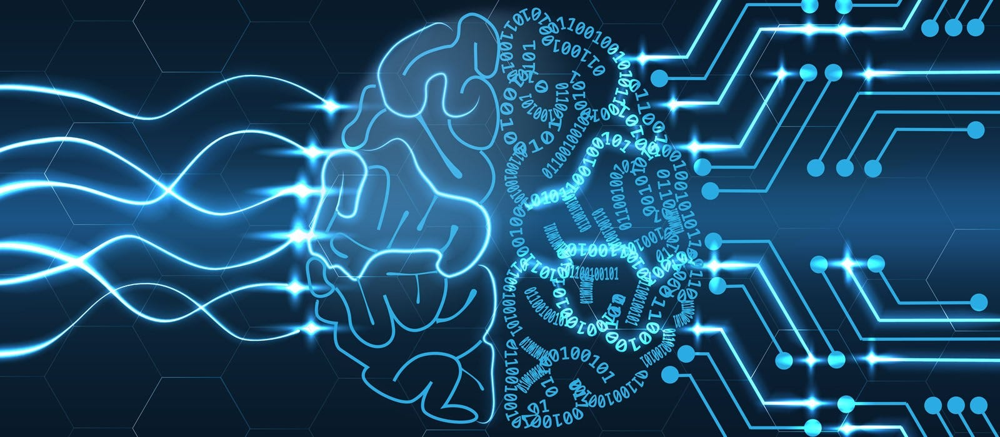

# Deep Learning and Neural Networks Projects



Welcome to the Deep Learning and Neural Networks Projects repository! This repository contains a collection of projects focusing on various deep learning and neural network techniques implemented using popular frameworks such as TensorFlow, PyTorch, and Keras.

## Table of Contents

- [Introduction](#introduction)
- [Installation](#installation)
- [Usage](#usage)
- [Contributing](#contributing)
- [License](#license)

## Introduction

Deep learning and neural networks are at the forefront of modern artificial intelligence research, enabling machines to learn complex patterns and representations from data. This repository serves as a showcase of different deep learning projects covering a wide range of applications and techniques.

## Installation

To run the projects locally, follow these steps:

1. Clone the repository:

```
git clone https://github.com/Sousannah/deep-learning-and-neural-networks-projects
```

2. Navigate to the project directory:

```
cd deep-learning-and-neural-networks-projects
```

3. Install the required dependencies:

```
pip install -r requirements.txt
```

## Usage

Each project directory contains its own README with detailed instructions on how to install and run the project. Please refer to the respective project's README for specific usage instructions.

## Contributing

Contributions are welcome! If you'd like to contribute to this repository, please fork the project, make your changes, and submit a pull request.

## License

This repository is licensed under the [MIT License](LICENSE).
